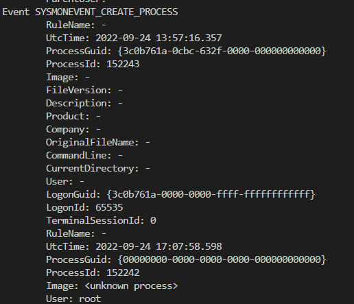

# LinuxVisibilityContainer

An Ubuntu container with Sysmon for Linux Configured

# General Notes

- This doesn't work fully, most of the events come back as null
- Please check the dockerfile for references to projects used
- Not designed to be used in production environments, for research & testing only
- Please feel free to modify / fork
- Note: This project is "best effort" level of support, I'm still learning :) 

  

# Usage

Clone Repo: 

`git clone https://github.com/Antonlovesdnb/LinuxVisibilityContainer`

Build the container: 

- Make sure you're in the LinuxVisibilityContainer directory

`docker build -t linuxvis -f linuxviscontainer.dockerfile .`

OR 

`docker build -t linuxvis -f linuxviscontainer.dockerfile . --no-cache`

Start the container: 

`docker run -d --name linuxvis --privileged -v /sys/fs/cgroup:/sys/fs/cgroup:ro -v $PWD/logs/:/var/log/ linuxvis`

Get a shell into the container: 

`docker exec -it linuxvis /bin/bash`

Run: 

`bash start.sh`

Browse to the logs directory on the host system and open up the `syslog` file

Enjoy Sysmon (mostly broken) logs!

